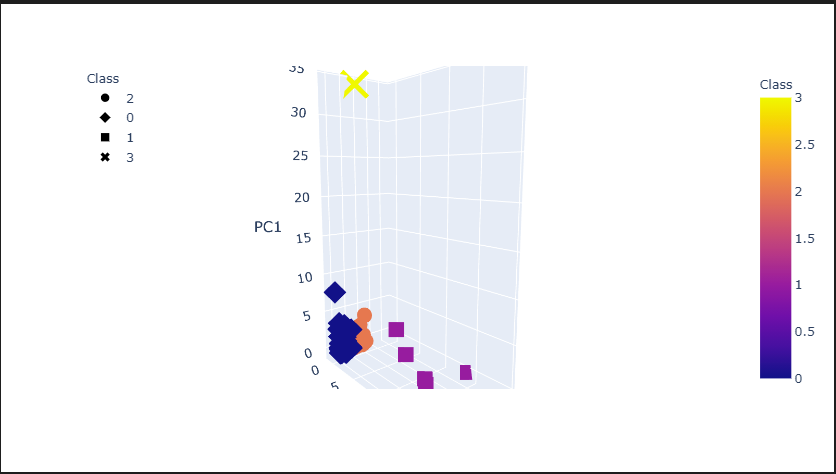

# cryptocurrencies
### Purpose
  The following analysis was done on crytocurrencies using unsupervised machine learning. The data was read in from an csv file and promptly cleaned and preprocessed using PCA and clustered with kmeans. The data results were then visualized with hvplot through a 3d scatterplot and a 2d scatterplot. One observation that should be of note is that bittorrent seemed to be the outlier in both graph models.
  
  ### Example
  
